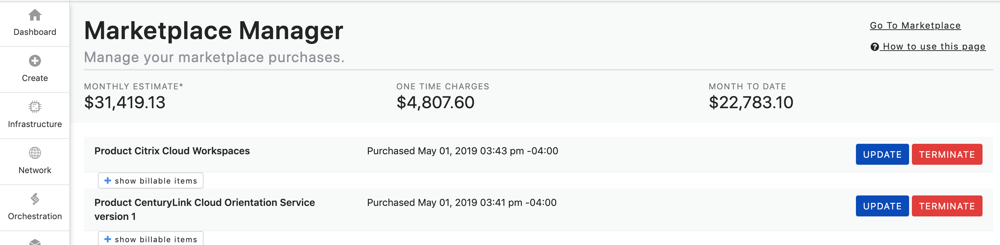
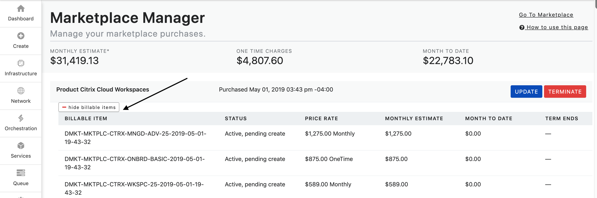
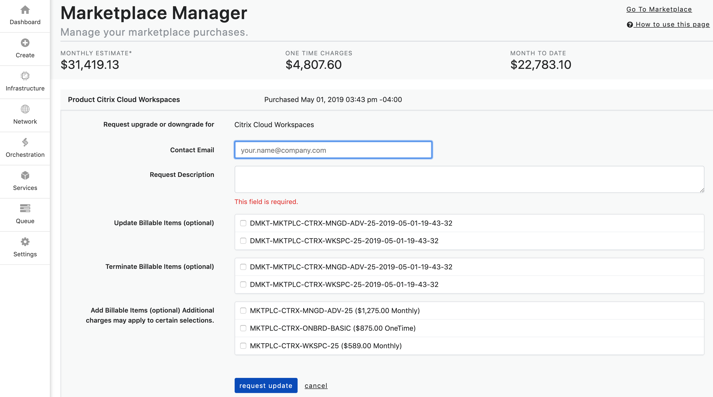
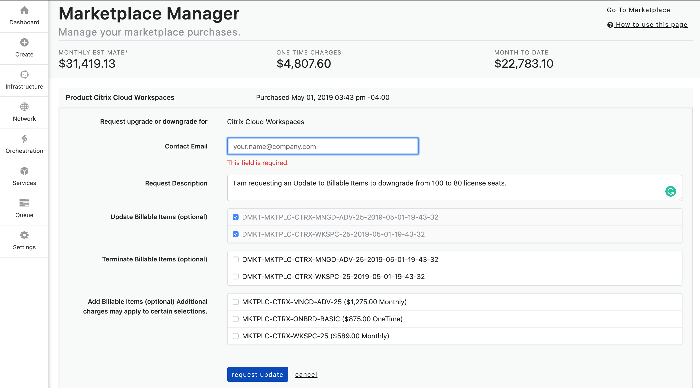
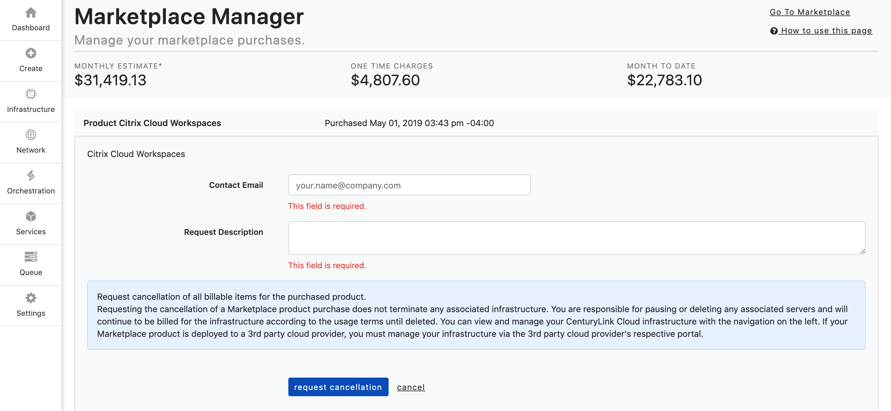

{{{
"title": "Managing Your Marketplace Subscriptions",
"date": "11-23-2020",
"author": "Brandy Smith; 9-17-2021 Randy Roten edits",
"attachments": [],
"contentIsHTML": false,
"sticky": true
}}}

**Important Update 11-23-2020** 

As of December 31st 2020, Lumen Marketplace will be decommissioned. 
This means that the Marketplace will not be accessible and no new orders will be allowed to be purchased via the Marketplace after December 31st 2020.
Lumen will continue to support existing Marketplace customers and Partners with any Marketplace subscriptions until their term commit date. 
Please see the section labeled **Marketplace Support** below for more details on how to get support of Marketplace offers.
This change will not affect the customers current subscriptions, management, or billing. 
Customers can still manage their subscriptions via the Marketplace Manager by following the steps outlined below. 
**At this time there is no action required by customers.** 

**Marketplace Customers with Term Commit Subscriptions**

Customers will continue to receive email notifications when their Marketplace services are nearing renewal. 
Prior to the renewal customers will receive instruction on how to terminate or migrate their subscription (if applicable). 
Lumen will notify customers directly via email. 
 
**Marketplace Customers with Month-to-Month Subscriptions**

Customers will be able to continue with the service on a month-to-month subscription model until Lumen notifies them of their go-forward options. 
Lumen will notify customers directly via email. 

**Marketplace Support**

Support for 3rd Party Products and Services provisioned through the Lumen Marketplace is rendered by the individual 3rd Party Provider. 
The Lumen Customer Care Team is unable to provide support for 3rd Party Products and Services purchased via the Marketplace. 
Please reach out to the vendor directly for support options. 
If you are experiencing issues with the infrastructure that hosts your Marketplace product and/or software please open a ticket with the Lumen team at help@ctl.io. 

**Questions or Concerns** 

If you are a Marketplace customer or Provider and have any questions or concerns regarding this notice, please feel free to reach out to our team via email [Marketplace team](mailto:Marketplace@centurylink.com).

**Managing Your Marketplace Subscriptions**

### Description
In this KB article, we walk through how to manage your Marketplace subscriptions via the [Marketplace Manager](https://marketplace.ctl.io/). The Marketplace Manager provide Marketplace customers with a dashboard view into all of their Marketplace subscriptions and estimated monthly billing charges.

### Audience

* Marketplace customer

### Steps to Manage Marketplace Subscriptions

**Log in:** You can log in to the Marketplace Manager by going to https://marketplace.ctl.io/ and using your Lumen Cloud credentials to log in. You can also access the Marketplace Manager via the Lumen Cloud control portal at https://control.ctl.io/, and log in using your Lumen Cloud account credentials. Once in the Lumen Cloud control portal you can access the Marketplace Manager under the **Orchestration** tab, then click **Marketplace Manager.**

**Reviewing Subscriptions:** Once logged in you can view your Marketplace subscriptions, see estimated monthly charges, request updates to your subscriptions (such as upgrades or downgrades), and terminate subscriptions (if no active term commit is in place). Please note that any taxes, overage, or usage based charges associated with your order are not listed. Rather, they will be reflected on your monthly invoices when applicable.

  

All subscriptions are shown at the Subscription Order level. By clicking the **+ Show Billable Items** button the subscription will expand to show all billable items that are associated with the subscription. These billable items can include monthly, hourly, usage, and one-time charges. You can collapse the billable items by clicking the **- Hide Billable Items** button.

  

**Managing Subscriptions:** There are two actions that can be executed in the Marketplace Manager; **Update** and **Terminate**.

### Update Request

The **Update** button allows customers to update their Marketplace subscriptions.

The Update option can be used for various use cases, below are a few examples.  

If a customer wants to add additional quantities to a billable item in their subscription:
Ex. Customer has a 10 license seat subscription and wants to add 10 additional license seats.

The customer can also use the Update option to downgrade their subscription:
Ex. Customer has a 100 license seat subscription and wants to downgrade to an 80 license seat subscription.

The downgrade option can also be used if a customer wants to terminate only some of the billable items for the subscription:
Ex. Customer has a subscription that has a core product with multiple add-ons and customer wants to terminate one or all of the add-ons but NOT the core product.

#### Steps to Make an Update Request

1. To update a subscription click on the **Update** button. The form below will populate.

  

2. Next, fill out the form. The **Contact Email** will auto-populate, however, you can change it to another email if you choose.
Fill out the **Request Description** field with your request. The request description should state which action you are looking to request.

The options are:

a. Update Billable Items

b. Terminate Billable Items

c. Add Billable Items *Additional charges may apply to certain selections*

Ex. I am requesting an Update Billable Items to downgrade from 100 to 80 license seats.

Ex. I am requesting to Terminate Billable Items.

Ex. I am requesting to Add Billable Items to my subscription. Please add 10 license seats.

3. Lastly, you will check the billable item(s) that you are wanting to update from the dropdown list that matches the update option that you are requesting.

  

4. Click **Request Update** button to submit the request. You will receive a conformation email that your request has been received. *Please note: Submitting an Update Request is a manual process, it does not automatically alter functionality or billing of the product.*

5. The Provider of the Service for which you requested an update will contact you via email. They will communicate to you when your request has been fulfilled, including when the new functionality and updated billing will begin.

### Terminate

The **Terminate** button allows customers to terminate their Marketplace subscriptions that do NOT have an active term commit associated with them. If there is an active term commit associated with the subscription, the terminate button will not populate for that subscription until 30 days prior to the end of the term commit date. For subscriptions with term commits, you will be notified via email 30 days prior to your term commit end date. If you choose to keep the service no action is needed on your part. The subscription will auto-renew for the same terms. If you wish to terminate the subscription, you must do so via the Terminate request prior to the term commit end date.

#### Steps to Make a Terminate Request

1. To make a termination request for a subscription, click on the **Terminate** button. The form below will populate.

  

2. Next, fill out the form. The **Contact Email** will auto-populate, however, you can change it to another email if you chose.
Fill out the **Request Description** field with your request.

Ex. I am requesting termination of my subscription.

3. Click the **Terminate** button to submit the request. You will receive a conformation email that your request has been received. *Please note: Submitting a terminate request is a manual process, it does not automatically terminate the subscription or immediately stop billing of the product.*

5. The Provider of the Subscription for which you requested a termination will contact you via email. They will communicate to you when your termination request has been fulfilled with the date that billing will end.

If you have questions about your Marketplace subscription or how to use the Marketplace Manager, please reach out to the [Marketplace team](mailto:Marketplace@centurylink.com). 
