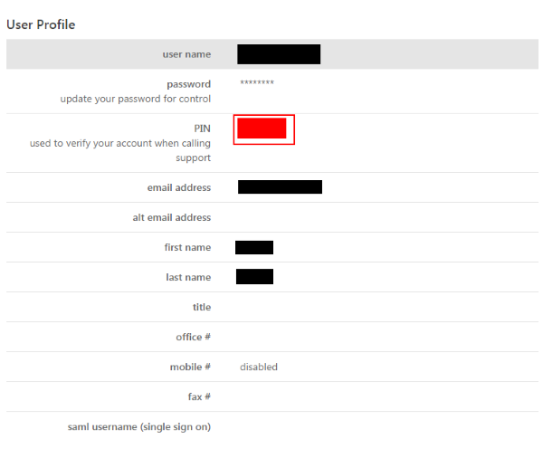
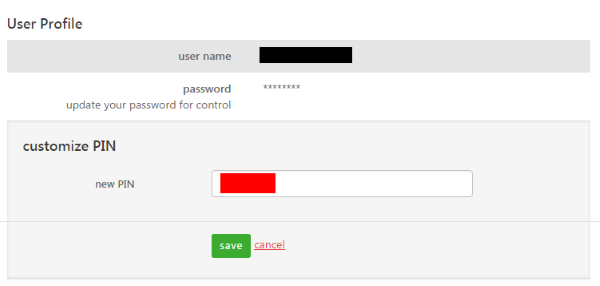

{{{
  "title": "PIN Authentication for Support Requests",
  "date": "2-29-2019",
  "author": "",
  "attachments": [],
  "contentIsHTML": false
}}}

### Overview
When submitting a support request, Lumen Cloud requires that the requester supply a personal identification number (PIN) as a secondary means of authentication. This measure is designed to add an additional layer of security to prevent user impersonation and unauthorized changes.

### Finding Your PIN
1. Log in to the [Control Portal](//control.ctl.io).
2. Click your username in the top-right corner of the page, and select **My Account**.

Your PIN will be displayed on the user profile page.

### Changing Your PIN
1. Select the **PIN** field.
2. Enter a new value with the following requirements.
   - numbers only
   - no alphabetic/special characters
   - 10 character limit

### Notes
If you have multiple login IDs, please indicate which username corresponds to the PIN you are supplying.
