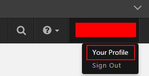

{{{
  "title": "PIN Authentication for Support Requests",
  "date": "3-16-2017",
  "author": "",
  "attachments": [],
  "contentIsHTML": false
}}}

### Overview
When submitting a support request, CenturyLink requires that the user supply a pre-defined, unique PIN number as a secondary means of authentication. This measure is designed to add an additional layer of security to prevent account impersonation and unauthorized changes.

### Determine Your PIN
To access or change your PIN follow the steps below.

1. login to the [Control Portal.](//control.ctl.io)

2. Once you have logged in, click your **Username** in the top right hand corner of the page and select **Your Profile.**

    

3. Your PIN will be displayed on the user profile page.

    

### Set Your Own PIN
If you wish to manually set your PIN, mouse-over the PIN field and click. You can then enter a custom PIN (numeric, no alphabetic or special characters, 10 character limit).  Once completed save your new PIN.

  

### Notes
When submitting a support request, if you have multiple accounts, please indicate which username corresponds to the PIN you are supplying.
