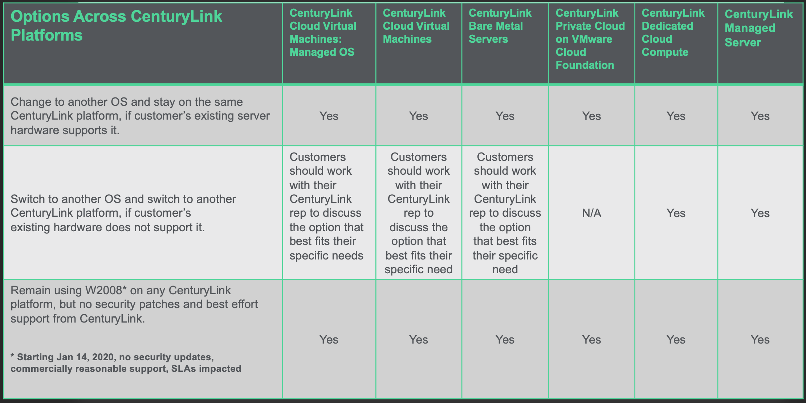

{{{
  "title": "Windows Server 2008/2008R2 End of Vendor Support FAQ",
  "date": "05-23-2019",
  "author": "Brandy Smith",
  "attachments": [],
  "contentIsHTML": false
}}}

### Description

This communication is an important announcement regarding the end of vendor support from Microsoft for Windows Server 2008/2008R2. Windows Server 2008/2008R2 are approaching the end of their support lifecycle.

This document is to provide CenturyLink customers with information regarding what the end of vendor support for Windows Server 2008 includes and what options are available per platform.
Customers may be using multiple CenturyLink platforms and the options available to you may vary across the platforms. We have created support documentation below that outline the options per platform, as well as an FAQ, providing answers to the most frequently asked questions. 

###  About Windows Server 2008/2008R2 End of Vendor Support

Mainstream support for Windows Server 2008/2008R2 ended Jan 2015, however, CenturyLink has provided Extended Support across all platforms, allowing CenturyLink to provide valuable security updates to our customers. 

Microsoft’s announcement of end of support for Windows 2008 means that as of **January 14, 2020** there will be:
	
* No additional free security updates on-premises
* No further non-security updates
* No free support options
* No online technical content updates

### Options Across CenturyLink Platforms

Below is a Matrix that outlines the options available to CenturyLink customers across Platforms.

The options listed are the top recommended options to ensure the highest level of security for the customers environment.

CenturyLink understands that these options may not be viable for all customer environment and encourage customers to reach out to their CenturyLink sales representative to discuss their options and help create a plan that best fits their unique business needs.

**Important Notice:** As of January 14, 2020, there will be no further security updates, no free support, and no online technical content updates. If a customer chooses to stay on Windows Server 2008/2008R2 beyond January 14, 2020 CenturyLink will provide best-effort support with no SLAs. 

### Frequently Asked Questions

**Q: What does End of Sale and End of Vendor Support mean?**

A: End of Sale status means that the vendor, in this instance Microsoft, has suspended any future sale of the product.

End of Vendor Support (EVS) means that the vendor, in this instance Microsoft, will discontinue all support of the product including software patches, bug and security fixes, and will no longer supply hardware replacements.

**Q: Can I create a new W2008 server prior to January 2020?**

A: This option is only available on the following Platforms:

CenturyLink Private Cloud on VMware Cloud Foundation**

CenturyLink Dedicated Cloud Compute**

CenturyLink Cloud Virtual Machines: Managed OS** - Yes, but only until 12/31/2019

CenturyLink Cloud Virtual Machines** - Yes, but only until 12/31/2019

CenturyLink Bare Metal Servers** - Yes, but only until 12/31/2019

**Q: Can I order a new W2008 server prior to Jan 2020?**

A: This option is only available on the following Platforms:

CenturyLink Private Cloud on VMware Cloud Foundation**

CenturyLink Dedicated Cloud Compute**

CenturyLink Managed Server**

**Q: Can I create a new W2008 server after January 2020?**

A: This option is only available on the following Platforms:

CenturyLink Private Cloud on VMware Cloud Foundation**

CenturyLink Dedicated Cloud Compute**

**Q: Can I order a new W2008 server after January 2020?**

A: This option is only available on the following Platforms:

CenturyLink Private Cloud on VMware Cloud Foundation**

CenturyLink Dedicated Cloud Compute**

CenturyLink Managed Server**

**Q: Does CTL offset any of the cost to migrate?**

A: No, there are fees associated with migration. However, if the customer is doing a tech refresh to a new version or Platform, there will be no early termination fees applied to the account.  

**Q: What should I do if I am unsure which CenturyLink Platforms I have and which ones have Windows 2008?**

A: Please contact your CenturyLink CSP or Sales Representative to review your CenturyLink products and Services.

**Q: What if customers have more questions?**

A: Customers are encouraged to contact their CSP or Sales Representative.

**Q: What if I do not know who my CSP or Sales Representative is or how to contact them?**

A: Please contact 800-728-8471 for assistance.

**Q: What if customers don’t take action?**

A: Customers are encouraged to act, but if they don’t they should expect the following based on the platform:

CenturyLink Managed Server: best effort support, no SLA, no security patches, and possibly a future announcement that the OS cannot be operated in the CTL environments.

CenturyLink Dedicated Cloud Compute: best effort support, no SLA, no security patches, and possibly a future announcement that the OS cannot be operated in the CTL environments.

CenturyLink Private Cloud on VMware Cloud Foundation: best effort support, no SLA, no security patches, and possibly a future announcement that the OS cannot be operated in the CTL environments.

CenturyLink Cloud: best effort support, no SLA, no security patches, and possibly a future announcement that the OS cannot be operated in the CTL environments or possibly a future announcement that VMs will be removed.

** As of January 14, 2020, there will be no further security updates, no free support, and no online technical content updates. CenturyLink will provide best-effort support with no SLAs.

CenturyLink strives to offer a vast portfolio of valued services in alignment with our vision to provide best of class services.  Technology and the digital landscape are constantly evolving, and our goal at CenturyLink is to ensure that our customers have access and are informed about the most secure and up to date offers. At CenturyLink it is our mission to reduce friction along the digital transformation path for all of our customers so that they can focus on what is important &mdash; growing their business and taking care of their customers.  We look forward to assisting you with this End of Vendor Support effort and your future business needs.
