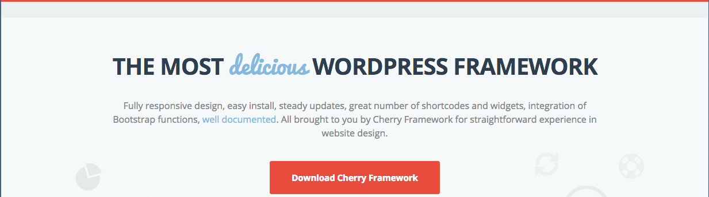

{{{
  "title": "How To Setup Cherry Framework for WordPress",
  "date": "09-02-2015",
  "author": "Andy Watson",
  "attachments": [],
  "related-products" : [],
  "contentIsHTML": false,
  "sticky": false
}}}

### IMPORTANT NOTE

CenturyLink WordPress hosting is currently in a Limited Beta program with specific customers by invitation only and is not intended for production usage at this time.

During the Limited Beta there is no production Service Level Agreement.

### Overview
The [Cherry Framework for WordPress](http://www.cherryframework.com/) is a free framework that can use WordPress themes from Template Monster that are made to use with the Cherry Framework. 

Most of what you need to know is already covered in the [quick start guide on Template Monster](http://www.templatemonster.com/help/quick-start-guide/wordpress-themes/master/index_en.html#introduction).  In this KB article, we will cover how to install and setup Cherry Framework on the [CenturyLink WordPress](https://www.ctl.io/wordpress) hosting platform so that you can take advantage of it.

### Cherry Framework Features
Cherry Framework comes with a robust amount of features and options that makes it a very powerful addition. Check out the full list on the [Cherry Framework website](http://www.cherryframework.com/features/).

### Installing the Cherry Framework

1. First you will need to setup your [local developement environment](https://www.ctl.io/knowledge-base/wordpress/wordpress-local-development/).

2. Next is to [download and save the framework](http://www.cherryframework.com/) from the Cherry Framework website for the local environment.

   

3. Follow the instructions in Step 1 of the [quick start guide](http://www.templatemonster.com/help/quick-start-guide/wordpress-themes/master/index_en.html#cherryframework_installation) to install the the framework for the local environment.

4. Activate any plugins that are installed with the framework.

5. Push the site [updates with Git](https://www.ctl.io/knowledge-base/wordpress/wordpress-site-updates-with-git/).

6. Once the site updates have been made. Login to wp-admin on your live site and activate the theme and plugins associated with the Cherry Framework.

### Conclusion
After completing the steps above, you should now be able to apply themes from Template Monster as well as use the rich features and options the framework has to offer.
