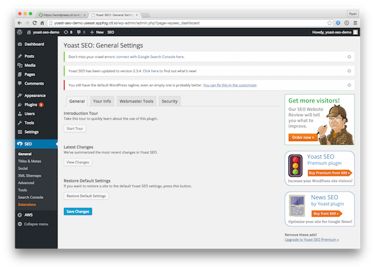

{{{
  "title": "How To Setup Cherry Framework for WordPress",
  "date": "08-31-2015",
  "author": "Andy Watson",
  "attachments": [],
  "related-products" : [],
  "contentIsHTML": false,
  "sticky": false
}}}

### IMPORTANT NOTE

CenturyLink Cloud WordPress hosting is currently in a Limited Beta program with specific customers by invitation only and is not intended for production usage at this time.

During the Limited Beta there is no production Service Level Agreement.

### Overview
The [Cherry Framework for WordPress](http://www.cherryframework.com/) is a free framework that can use WordPress themes from Template Monster that are made to use with the Cherry Framework. 

Most of what you need to know is already covered in the [quick start guide on Template Monster](http://www.templatemonster.com/help/quick-start-guide/wordpress-themes/master/index_en.html#cherryframework_installation) that you can find on their website.  In this KB article, we will cover how to install and setup Cherry Framework on the [CenturyLink Cloud WordPress](https://www.ctl.io/wordpress) platform so that you can take advantage of it.

### Installing the Cherry Framework

1. First you need to setup your [local developement environment] (https://www.ctl.io/knowledge-base/wordpress/wordpress-local-development/).

2. Next is to [download and save the framework](http://www.cherryframework.com/) from the Cherry Framework website.  

3. Navigate to appearance>themes in the WordPress admin console and select "Add New Theme" and select the cherryframework.zip file.

4. Activate the Theme
5. Activate the two plugins that come.
6. Git push the changes
7. Once the push has been made, the theme and plugins will need to be reactivated.
8. 

### Creating a theme using Cherry Framework

Now that you have the framework installed, go ahead and [view the instructions](http://www.templatemonster.com/help/wordpress-how-to-create-a-child-theme-based-on-cherry-framework.html).  In section 1, it makes several recommendations about setting up the URL and permalinks for your site.  For the most part, you can follow these recommendations as-is, but there are a couple of items to make note of:

### Conversion Optimization and Comment Optimization

You should be able to work through Sections 2, 3, and 4 of the Yoast tutorial on your own.  However, when you g

### Conclusion
After completing the steps above, you should now be able to apply themes from Template Monster or create new themes using the Cherry Framework.