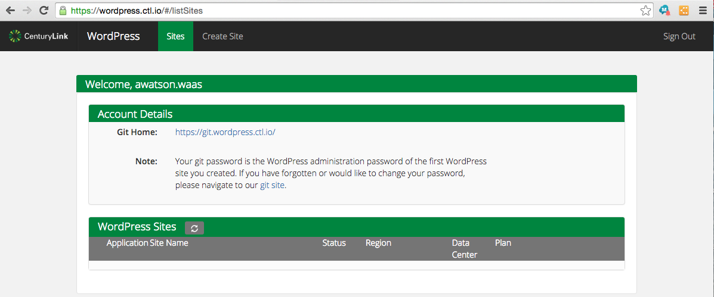

{{{
  "title": "Getting Started with WordPress as a Service",
  "date": "07-17-2015",
  "author": "Bill Burge",
  "attachments": [],
  "contentIsHTML": false
}}}

### IMPORTANT NOTE

CenturyLink Cloud WordPress hosting is currently in a Limited Beta program with specific customers by invitation only and is not intended for production usage.

During the Limited Beta there is no production Service Level Agreement.

## Overview

[WordPress](http://www.wordpress.org) is a free open-source blogging tool and content management system (CMS) based on PHP and MySQL.

CenturyLink Cloud's WordPress as a Service is a secure, Enterprise class, cloud-based WordPress installation for enterprise level customers.

### Prerequisites

* Access to the CenturyLink Cloud platform as an authorized user.

## Configuring a New WordPress Site

1. Browse to the [CenturyLink Cloud WordPress Site Creation Login](https://wordpress.ctl.io)

  

2. Input your CenturyLink Cloud username and password and click Login

  

3. Click Create Site

  

4. Chose a Plan, input the Name for your site and your preferred password, and click Create

  

5. When created, you will then see the credentials for your WordPress site, and its associated phpMyAdmin and GitHub repository.

  

6. You will also receive an email from CenturyLink Cloud with limited site details.

  

7. You will also receive an email from CenturyLink WordPress's Git Repository asking for confirmation. Click Confirm your account.

  

8. This will take you to your WordPress site's repository

  

## Frequently Asked Questions

**Q: What are the differences between a standard WordPress install and a CenturyLink Cloud WordPress install?**

A: The CenturyLink Cloud WordPress as a service team has compiled a [knowledge base article for known WordPress Limitaions](wordpress-known-limitations.md).

**Q: How do I migrate my existing WordPress Site to CenturyLink WordPress as a Service?**

A: The CenturyLink Cloud WordPress as a service team has compiled a [knowledge base article for manually migrating a WordPress site to CenturyLink Cloud](wordpress-site-migration-to-centurylink-cloud.md).

**Q: Can I have persistent storage with CenturyLink Cloud WordPress as a Service?**

A: WordPress persistent storage must be [configured  with CenturyLink Cloud Object Storage](wordpress-persistent-storage-configuration.md).

**Q: How do I access the MySQL database for my WordPress Site?**

A: You can [access your WordPress database using phpMyAdmin](wordpress-database-access-with-phpmyadmin.md).

**Q: How do I install plugins and themes to my WordPress Site?**

A: You can [push plugins and themes to your WordPress site using your git repository](wordpress-plugin-installation.md).

**Q: How do I send email (such as password resets) with my WordPress Site?**

A: You must [configure SMTP for your WordPress site](wordpress-SMTP-Configuration.md) in order to send email.

**Q: Can I configure my own domain with CenturyLink Cloud WordPress as a Service?**

A: You can [configure your own domain name](wordpress-custom-domain-configuration.md) via the CenturyLink Cloud Portal.
