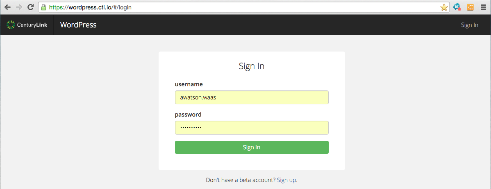
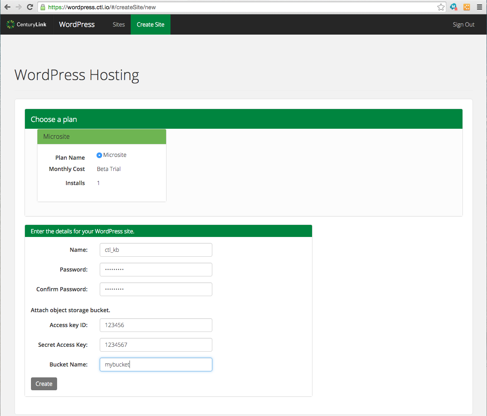

{{{
  "title": "Getting Started with Lumen WordPress Hosting",
  "date": "10-15-2015",
  "author": "Bill Burge, Andy Watson",
  "attachments": [],
  "contentIsHTML": false
}}}

### IMPORTANT NOTE

Lumen WordPress hosting is currently in a Limited Beta program with specific customers by invitation only and is not intended for production usage.

During the Limited Beta there is no production Service Level Agreement.

## Overview
Today nearly 25% of the sites on the internet are WordPress sites. WordPress is an open source project that started out as just a blogging system, but is now known as a content management system that is unlimited in ways that it can be used. There is also thousands of plugins, themes and widgets that help extend and add to the functionality that already comes with WordPress.

In addition to all that WordPress has to offer, there is an extensive and helpful community of WordPress users around the world. Questions and answers can be found in [support forums](https://wordpress.org/support/), [mailing lists](https://codex.wordpress.org/Mailing_Lists), [WordCamps](https://central.wordcamp.org/) and if that is not enough, thousands of video presentations exists and are being added to on [wordpress.tv](http://wordpress.tv/) to help everyone from the beginner to the expert.

Lumen's WordPress Hosting platform hosts secure, enterprise class, cloud-based WordPress sites.

### Prerequisites

* Access to the Lumen Cloud platform as an authorized user.

## Configuring a New WordPress Site

1. Browse to the [Lumen Cloud WordPress Site Creation Login](https://wordpress.ctl.io)

  

2. Input your Lumen Cloud username and password and click Login

  

3. Click Create Site

  

4. Chose a plan, input the appropriate fields. Then click the create button. We have also added the ability to connect a previously created [object storage bucket](https://www.ctl.io/knowledge-base/object-storage/using-object-storage-from-the-control-portal/) to your site for persistent storage.

  

5. When created, you will then see the credentials for your WordPress site, and its associated Git repository.

  

6. You will also receive an email from Lumen Cloud with limited site details.

  

7. You will also receive an email from the Lumen Git Repository asking for confirmation. Click Confirm your account.

  

8. This will take you to your WordPress site's repository

  

## Frequently Asked Questions

**Q: What are the differences between a standard WordPress install and a Lumen Cloud WordPress install?**

A: The Lumen WordPress hosting team has compiled a [Knowledge Base article for known WordPress Limitaions](wordpress-known-limitations.md).

**Q: I lost my Git confirmation email, how do I confirm my Git repository?**

A: Use the link here: https://git.wordpress.ctl.io/users/confirmation/new

**Q: How do I migrate my existing WordPress Site to Lumen's WordPress hosting platform?**

A: The Lumen WordPress hosting team has compiled a [Knowledge Base article for manually migrating a WordPress site to Lumen Cloud](wordpress-site-migration-to-lumen-cloud.md).

**Q: Can I have persistent storage with Lumen WordPress Hosting?**

A: WordPress persistent storage must be [configured  with Lumen Cloud Object Storage](wordpress-persistent-storage-configuration.md).

**Q: How do I access the MySQL database for my WordPress site?**

A: You can [access your WordPress database using external tools](https://www.ctl.io/knowledge-base/wordpress/wordpress-database-access-with-external-tools/).

**Q: How do I install plugins and themes to my WordPress site?**

A: You can [push plugins and themes to your WordPress site using your git repository](wordpress-plugin-installation.md).

**Q: How do I send email (such as password resets) with my WordPress site?**

A: You must [configure SMTP for your WordPress site](wordpress-SMTP-Configuration.md) in order to send email.

**Q: Can I configure my own domain with Lumen WordPress Hosting?**

A: You can [configure your own domain name](wordpress-custom-domain-configuration.md) via the Lumen Cloud Portal.

**Q: How do I update my WordPress site?**

A: You [push your committed changes with git](wordPress-site-updates-with-git.md).

**Q: How do I get a local development environment that's easy to work with?**

A: [vagrant up](wordpress-local-development.md)!
