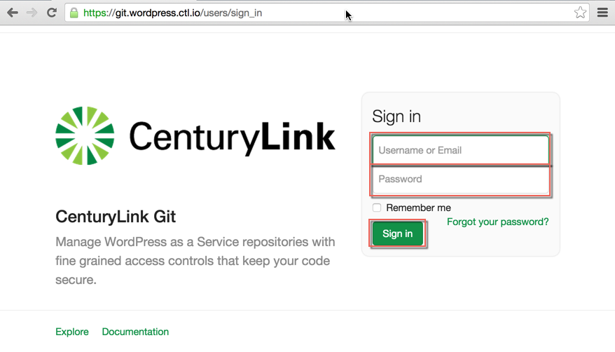
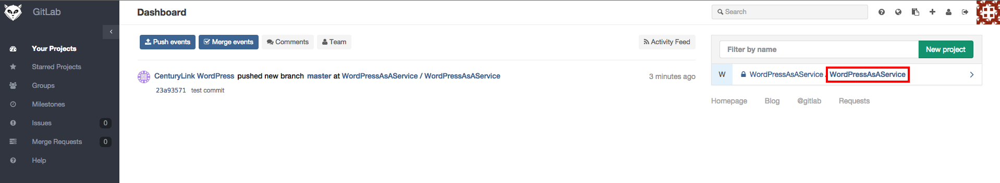
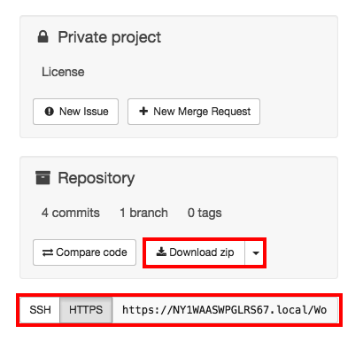

{{{
  "title": "WordPress Site Updates with Git",
  "date": "07-17-2015",
  "author": "Gregory McWilliams, Matt Wittmann, Bill Burge",
  "attachments": [],
  "contentIsHTML": false
}}}

### IMPORTANT NOTE

CenturyLink Cloud WordPress hosting is currently in a Limited Beta program with specific customers by invitation only and is not intended for production usage.

During the Limited Beta there is no production Service Level Agreement.

## Overview

When you need to make changes to your CenturyLink WordPress as a Service site, git is the way to go. CenturyLink
provides you with a copy of your WordPress site's source code on our own secure, private
[git servers](https://git.wordpress.ctl.io/). The general process is to clone your repository from our git
hosting, make your changes in the local repository, commit your changes in git, and finally push your commits
back up the remote repository on our git hosting. We take care of things from there to make sure your changes
are live in the next few minutes.

## Prerequisites

- You have already successfully created your WordPress site with CenturyLink's WordPress as a Service.
- You will log in to our git hosting with the CLC username you used when you created the site.
- You have the site's WordPress administrative password, which is also your git password.

## When You Should Do This

- You want to install or update a WordPress plug-in or theme.
- You need to customize the WordPress core.
- You are [migrating](wordpress-site-migration-to-centurylink-cloud.md) an existing WordPress site to CenturyLink's
  WordPress as a Service.

Don't do this if you are just posting new content (text, images, video) to your WordPress site. Please review
our documentation on [persistent object storage](wordpress-persistent-storage-configuration.md) for creating
multimedia content.

## Cloning from git

1. Browse to [git.wordpress.ctl.io](https://git.wordpress.ctl.io/) and log in using the following:

  - **Username:** CenturyLink Cloud username of the user who created the site
  - **Password:** WordPress administrative password provided on site creation

 *CLC users other than the one who created the site are not be able to view or edit the repository in git.*

   

2. Once you are logged in, select the project you would like to clone. The git project's name is the same as the WordPress site name provided on site creation.

   

3. Generally, the best way to make changes is to edit files on your own machine. To do this, clone the repository to your local machine using the HTTPS option. SSH is not supported.

   

   The command to clone the repository is:

       `git clone $REPOSITORY_HTTPS_URL`

   Note that repositories hosted in our git hosting are private, so you will be prompted to enter the appropriate username and password.

4. You now have a clean clone of the repository and are free to make changes as you see fit.

  Please see the [git documentation](http://git-scm.com/docs/git-clone) for more details on the git clone command.

## Pushing Your Changes Back to CenturyLink

In git, changes to a repository are said to be staged, ready for commit. Staged changes can then be committed with
a user-friendly message noting what has changed. One or more commits can be pushed to a remote repository, and new
commits from the remote repository can in turn be pulled back down to the local repository. The git documentation
provides further detail on [recording changes](https://git-scm.com/book/en/v2/Git-Basics-Recording-Changes-to-the-Repository)
and then [pushing them to a remote repository](https://git-scm.com/book/en/v2/Git-Basics-Working-with-Remotes#Pushing-to-Your-Remotes).

###A basic flow is as follows:

1. Once you have made your changes, stage them for commit with the following the command:

  `git add $NAME_OF_CHANGED_FILE`

   Or if you want to add all changes:

  `git add .`

2. Once changes have been staged, you are ready to commit:

  `git commit –m "Enter a message describing what you've changed here."`
3. Now can push your commit back to our git repository with the following command:

  `git push origin master`

4. From here, our git hosting lets the CenturyLink WordPress service know that you have made a change. The service will pull down your changes from the repository to update your live site! Please note that **only** commits pushed to the *master* branch will update your live site.

## That's It!

Voilà ! You have now learned how to clone a repository from git, commit your changes to git, and push them back up to a remote git repository.
