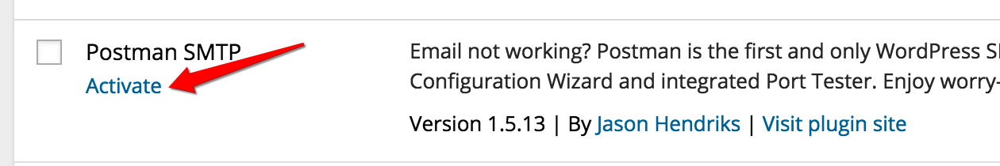
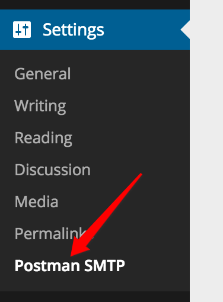
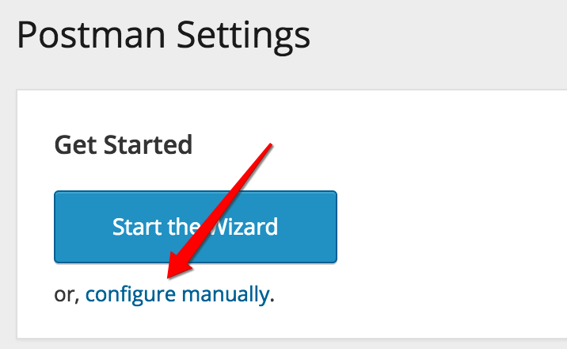
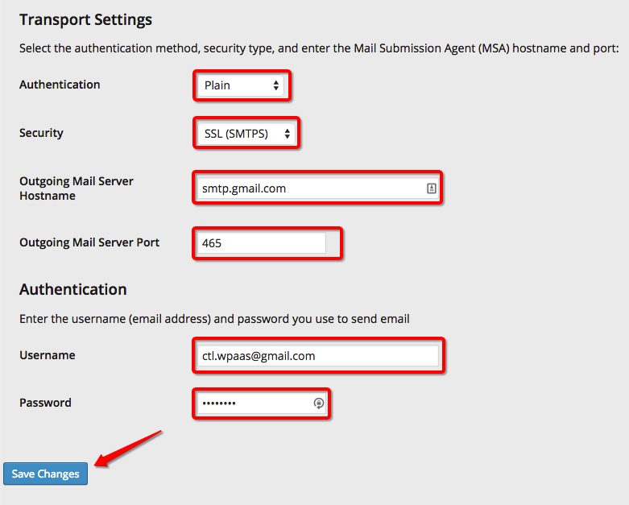
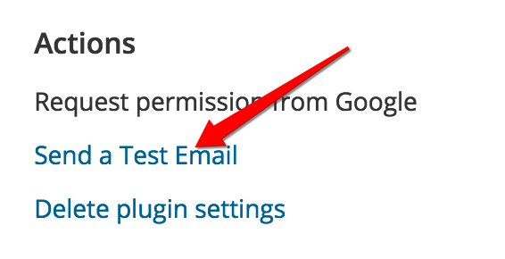
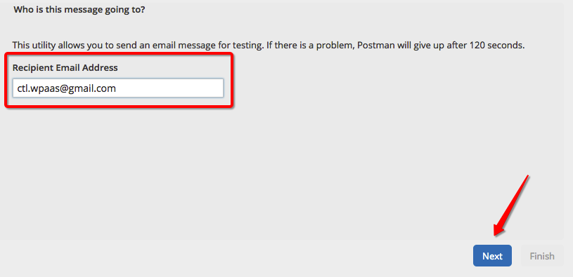
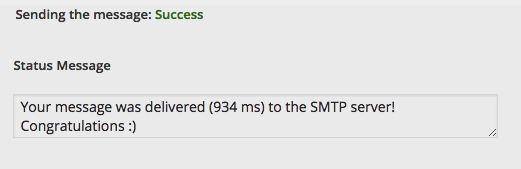

{{{
  "title": "WordPress SMTP Configuration",
  "date": "07-20-2015",
  "author": "Bill Burge",
  "attachments": [],
  "contentIsHTML": false
}}}
### IMPORTANT NOTE

CenturyLink Cloud WordPress hosting is currently in a Limited Beta program with specific customers by invitation only and is not intended for production usage.

During the Limited Beta there is no production Service Level Agreement.

## Overview

Out of the box, WordPress sends email using the [PHP mail()](http://php.net/manual/en/function.mail.php) function. This function is unauthenticated and, for this reason, CenturyLink Cloud WordPress does not allow this functionality and does not include an alternate SMTP relay.  In order to send WordPress user emails, like password resets, you will first need to configure a SMTP server using one of the many freely available plugins found on [WordPress.org](https://wordpress.org/plugins/)

As one example, [Postman SMTP Mailer](https://wordpress.org/plugins/postman-smtp/ "Postman SMTP Mailer") is capable of using many freely available SMTP servers as well as your enterprise's own. 

**NOTE:** [Postman 1.5.13](https://downloads.wordpress.org/plugin/postman-smtp.1.5.13.zip) is the latest version of the plugin supported by CenturyLink WordPress.

**In this example, Gmail will be used as the SMTP Relay and assumes the following:**

1. Ownership of a Gmail account.
2. Activation of the the [Less Secure Apps](https://www.google.com/settings/security/lesssecureapps) functionality of Gmail.
3. A working knowledge of how to install WordPress plugins to a CenturyLink Cloud WordPress site following the Knowledgebase article for [WordPress Plugin Installation](wordpress-plugin-installation.md).

## Example SMTP Plugin Configuration

1. Download and install [Postman SMTP Mailer](https://wordpress.org/plugins/postman-smtp/) to your WordPress site.

2. Activate Postman SMTP

  

3. Browse to Settings > Postman SMTP

  

4. Select configure manually.

  

5. Update the following settings with specifics for your SMTP Relay and click _Save Changes_.

  **Transport Settings:**

  * Authentication
  * Security
  * Outgoing Mail Server Hostname
  * Outgoing Mail Server Port

  **Authentication:**

  * Username
  * Password

  

6. Select Send a Test Email.

  

7. Input a Recipient Email Address and click Next.

  

8. If successful you will see the following success message.

  

