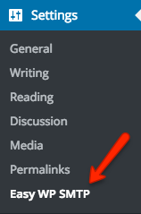
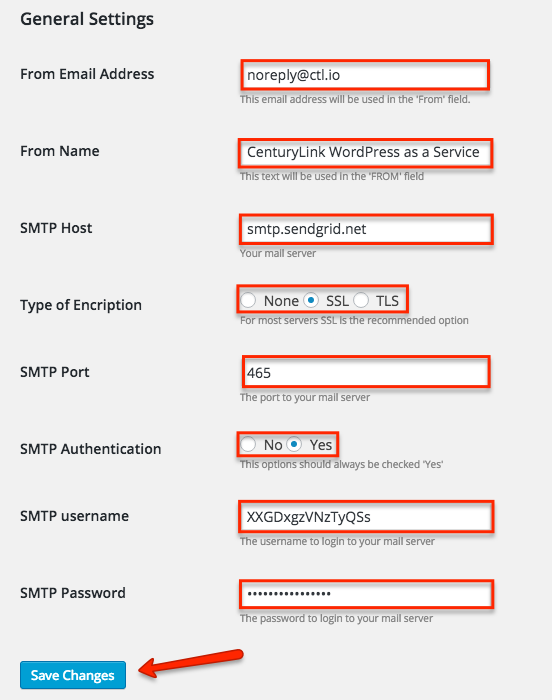
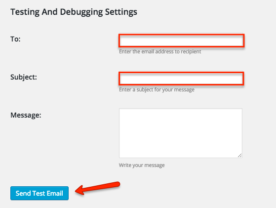

{{{
  "title": "WordPress SMTP Configuration",
  "date": "10-02-2015",
  "author": "Bill Burge, Gregory McWilliams",
  "attachments": [],
  "contentIsHTML": false
}}}
### IMPORTANT NOTELumen

Lumen WordPress hosting is currently in a Limited Beta program with specific customers by invitation only and is not intended for production usage.

During the Limited Beta there is no production Service Level Agreement.Lumen

### Overview

Out of the box, WordPress sends email using the [PHP mail()](http://php.net/manual/en/function.mail.php) function. This function is unauthenticated and, for this reason, Lumen WordPress hosting does not allow this functionality and includes the Easy WP SMTP plugin instead. Your WordPress site comes preconfigured with a limited SendGrid account. This account is limited to 1000 emails per month. Sending 1 email to 1000 recipients will immediately use all of these credits for the month. If you would like to send more emails, you will first need to reconfigure the SMTP plugin.

**In this example, Gmail will be used as the SMTP Relay and assumes the following:**

1. Ownership of a Gmail account.
2. Activation of the the [Less Secure Apps](https://www.google.com/settings/security/lesssecureapps) functionality of Gmail.

## Example Easy WP SMTP Plugin Configuration

3. Browse to Settings > Easy WP SMTP

  

4. Update the following settings with specifics for your SMTP Relay and click _Save Changes_.

  **General Settings:**
  
  * From Email Address
  * From Name
  * SMTP Host
  * Type of Encription
  * SMTP Port
  * SMTP Authentication
  * SMTP Username
  * SMTP Password

  

5. Input the following options for testing email configuration and click Send Test Email.

  

6. If successful you will see the following success message.

  
