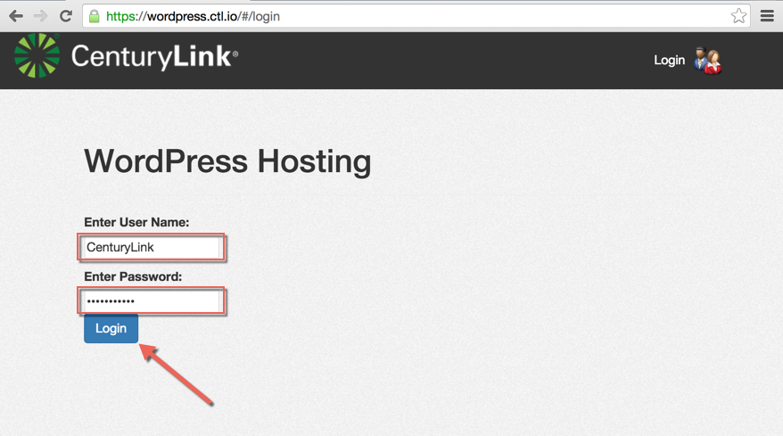
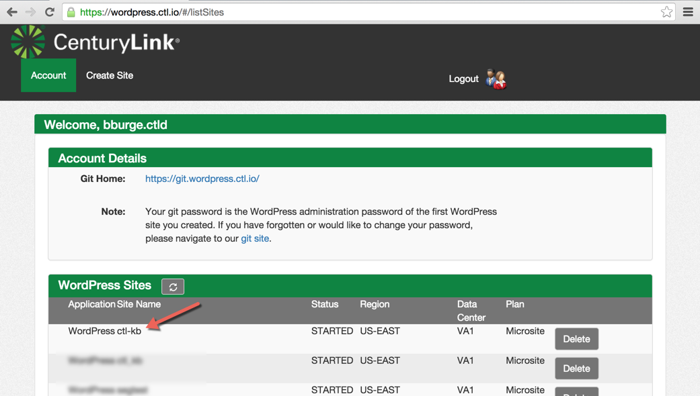
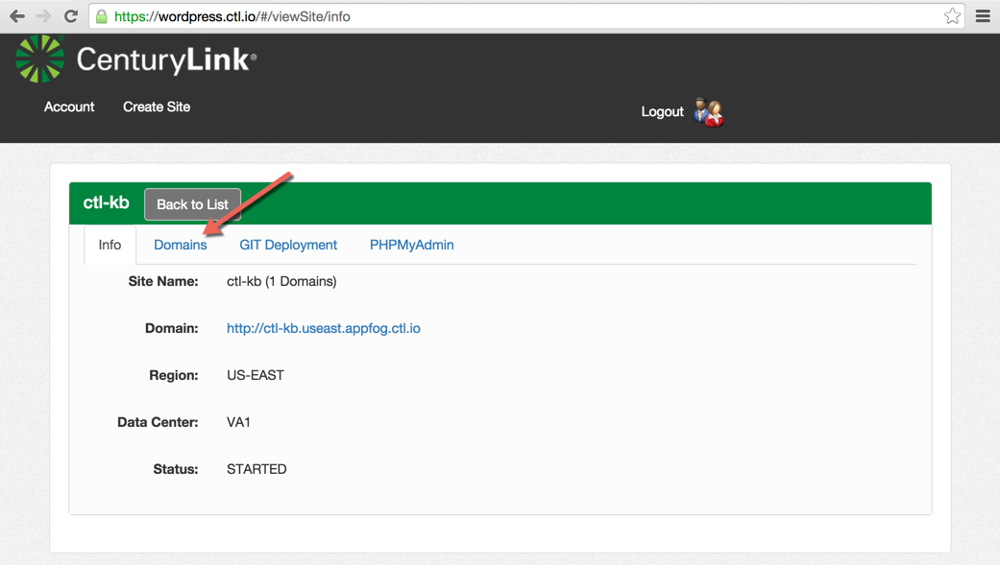
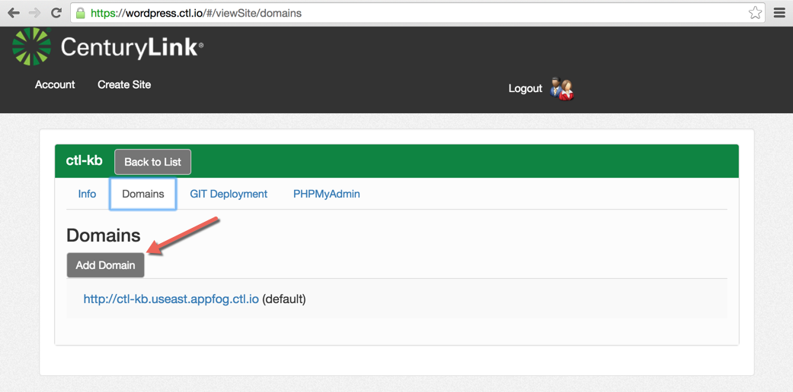
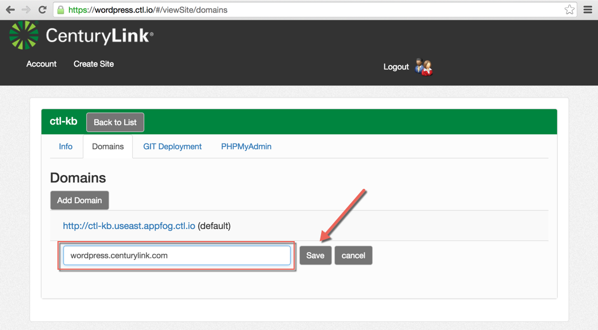
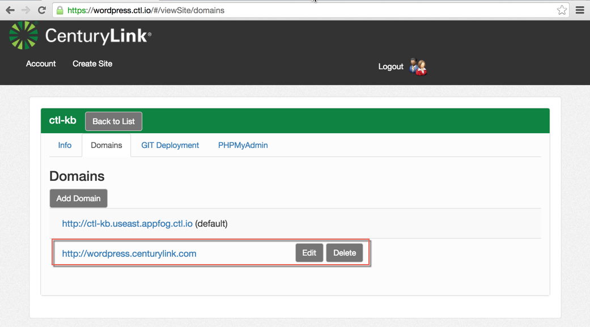
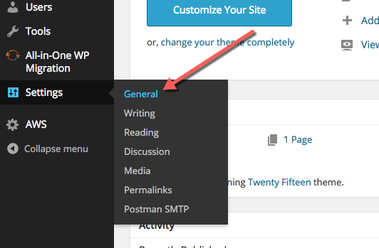
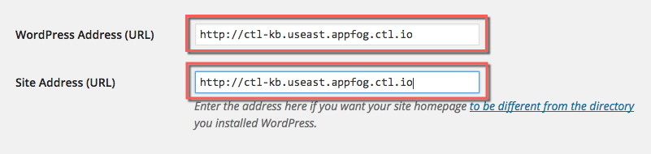
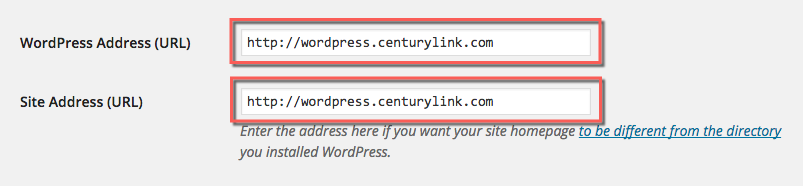
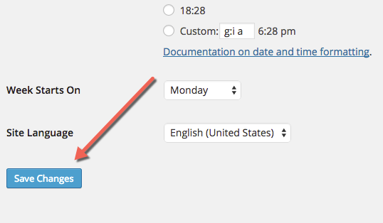

{{{
  "title": "WordPress Custom Domain Configuration",
  "date": "07-17-2015",
  "author": "Bill Burge",
  "attachments": [],
  "contentIsHTML": false
}}}

### IMPORTANT NOTE

CenturyLink Cloud WordPress hosting is currently in a Limited Beta program with specific customers by invitation only and is not intended for production usage.

During the Limited Beta there is no production Service Level Agreement.

## Overview
CenturyLink Cloud WordPress supports custom domain name configuration after [setting up a new site](getting-started-with-wordpress-as-a-service.md).

## WordPress Custom Domain Configuration

1. Browse to [wordpress.ctl.io](https://wordpress.ctl.io), login with your CenturyLink Cloud User Name and Password and click Login

  

2. From the list of WordPress Sites, select the site you would like to configure a custom domain for.

  _In this example ctl-kb_

  

3. Select the Domains tab.

  

4. Click Add Domain

  

5. Input your domain name and click Save

  _in this example wordpress.centurylink.com_

  

6. You will then see your saved domain name as an additional domain that can be edited or deleted.

  

7. Login to your WordPress site using the CenturyLink Cloud provided URL and browse to Settings > General

  

8. Find the section with the following variables
  * WordPress Address (URL)
  * Site ADdress (URL)

  

9. Input your domain name

  _in this example wordpress.centurylink.com_

  

10. Scroll to the bottom and click Save Changes

  

11. Your site is now using your custom domain name.
