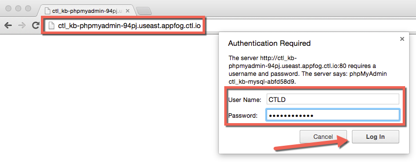
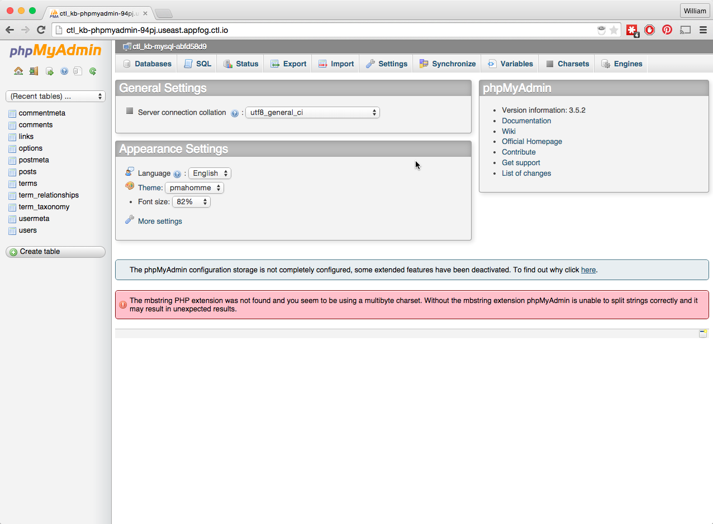

{{{
  "title": "WordPress Database Access with phpMyAdmin",
  "date": "07-17-2015",
  "author": "Bill Burge",
  "attachments": [],
  "contentIsHTML": false
}}}

### IMPORTANT NOTE

CenturyLink Cloud WordPress hosting is currently in a Limited Beta program with specific customers by invitation only and is not intended for production usage.

During the Limited Beta there is no production Service Level Agreement.

## Overview

WordPress uses a MySQL relational database for storing and retrieving content like posts, pages, image paths and comments as well as user login information.

At times it is necessary to manage the database to resolve issues or add functionality.  With your CenturyLink Cloud WordPress site this is achieved via the free php software tool, [phpMyAdmin](http://www.phpmyadmin.net).

### Prerequisites:

* The phpMyAdmin URL provided by CenturyLink during WordPress Site Creation
* The phpMyAdmin username provided by CenturyLink during WordPress Site Creation
* The phpMyAdmin password provided by CenturyLink during WordPress Site Creation

## WordPress MySQL Database Access with phpMyAdmin

1. In a web browser navigtate to the phpMyAdmin URL provided by CenturyLink

2. Input the phpMyAdmin User Name and Password and click Log In

  

3. You will now have full access to phpMyAdmin

  

## Additional Links:

* [WordPress.org Database Description, Diagram, and Table Overview](https://codex.wordpress.org/Database_Description)
* [WordPress.org Database Code Reference (Functions, Hooks, classes, and methods)](https://developer.wordpress.org/reference)
