{{{
  "title": "WordPress Git Installation",
  "date": "08-07-2015",
  "author": "Bill Burge",
  "attachments": [],
  "contentIsHTML": false
}}}

### IMPORTANT NOTE

CenturyLink WordPress hosting is currently in a Limited Beta program with specific customers by invitation only and is not intended for production usage.

During the Limited Beta there is no production Service Level Agreement.

## Overview
Git is a lightweight, opensource, version control system. Initially designed for Linux, Git has been packaged for simple implementation on most operating systems and is the software used to clone and update CenturyLink WordPress repositories.

Git 1.7.10 or newer is required for interacting with your CenturyLink WordPress repository.  There are many methods of installing Git, and many excellent Graphical User Interfaces, but these are the most basic methods to get a working copy of Git installed on the most common operating systems.

* [Linux - Debian/Ubuntu](#debian)
* [Linux - Redhat/Fedora/CentOS](#redhat)
* [Mac](#mac)
* [Windows](#windows)

## Linux - Debian/Ubuntu Git Installation

1. Open a terminal
2. Run the following command to update your apt repository

  `apt-get update`

3. Run the following command to install the latest version of git  

  `apt-get install git`

## Linux - Redhat/Fedora Git Installation

At a terminal run the following command:

`yum install git`

## Mac Git Installation
1. [Browse to www.git-scm.com and download the latest Git OSX Installer](http://git-scm.com/download/mac)
2. Open the Installer dmg

  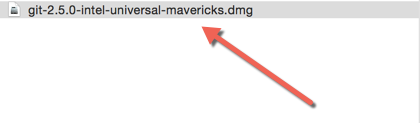
  
3. Open the Installation *.pkg

  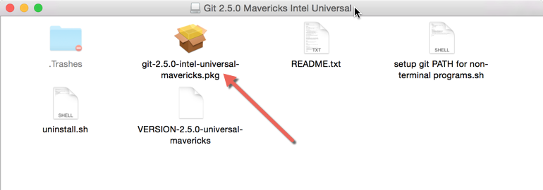
  
4. Click Continue

  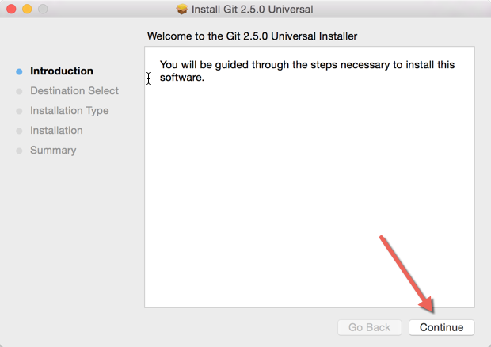
5. Click Install

  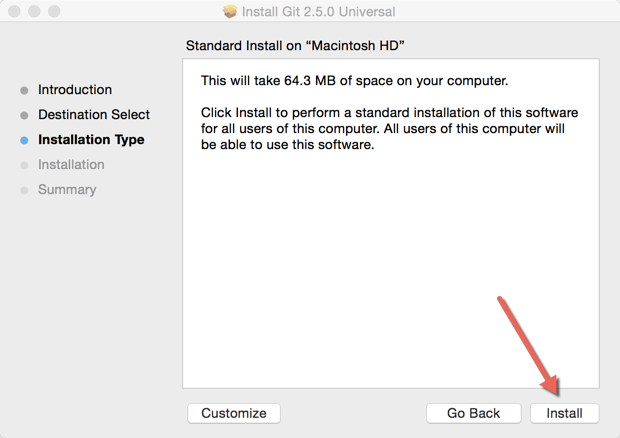
  
6. Input a valid Username & Password Combination with root access and click Install Software

  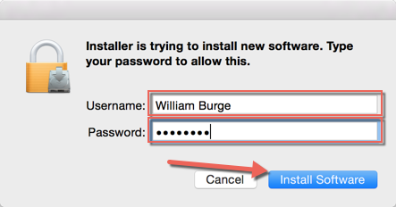
7. The software is now installed and ready to use

  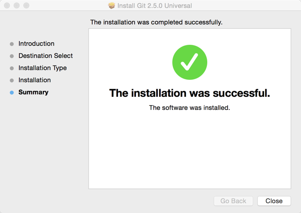

## Windows Git Installation
1. [Browse to www.git-scm.com and download the latest Windows Git Installation](http://git-scm.com/download/win)

2. Open the Git *.exe

  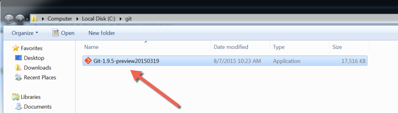

3. Click Run

  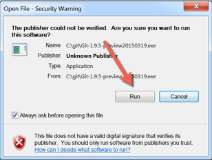

4. Click Next

  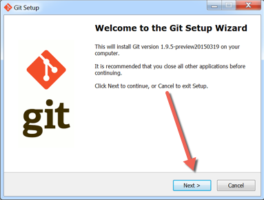

5. Click Next

  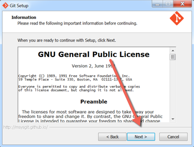 
  
6. Input the path you would like to install to and click Next
 
  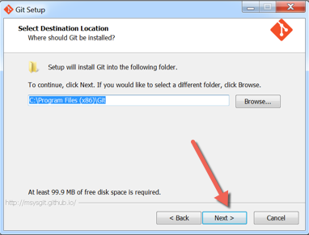

7. Click Next

  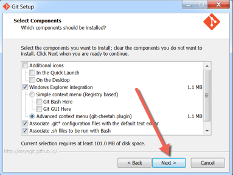

8. Click Next

  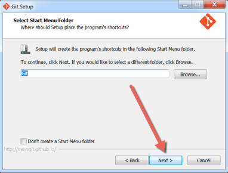

9. Choose _Use Git from the Windows Command Prompt_ and click Next.

  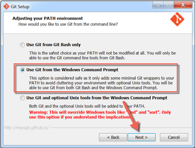

10. Click Next
 
  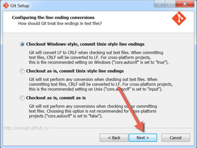

11. Uncheck _View ReleaseNotes.rtf and Click Finish

  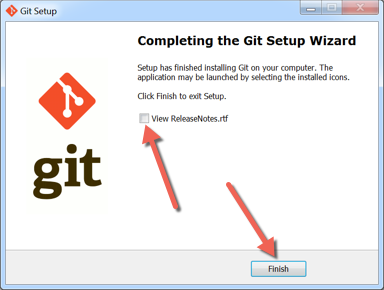
  
## Additional Links:
* [Further Information about Getting Started and working with Git Version Control](http://git-scm.com/book/en/v2/Getting-Started-About-Version-Control)
