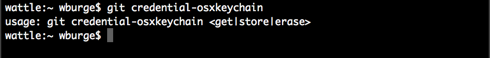
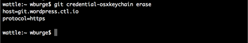

{{{
  "title": "WordPress Git Repository Password Caching",
  "date": "07-22-2015",
  "author": "Bill Burge",
  "attachments": [],
  "contentIsHTML": false
}}}

### IMPORTANT NOTE

CenturyLink Cloud WordPress hosting is currently in a Limited Beta program with specific customers by invitation only and is not intended for production usage.

During the Limited Beta there is no production Service Level Agreement.

## Overview

CenturyLink WordPress Git passwords can be cached. This enables you to work with your WordPress site's Git repository without the need to continue entering your username and password.
 
* [Linux](#linux)
* [Mac](#mac)
* [Windows](#windows)

**Note: If you are working with more than one CenturyLink Control ID account's WordPress Git repository, you will need to clear the cache between each connection.**

* [Linux](#linux_clear)
* [Mac](#mac_clear)
* [Windows](#windows_clear)

## Linux Git Repository Caching
**Prerequisite:** Git 1.7.10 or newer is installed

1. Enable Git to use the credential memory cache by running

  `git config --global credential.helper cache`

2. Increase the time Git will expire the cached password by running 

  `git config --global credential.helper 'cache --timeout=3600'`
  
  **Note:** This will edit the default expiration time from 15 minutes to 1 hour. This can be set as needed in seconds. For example, 8 hours would be `--timeout=28800`.

The next time you clone your CenturyLink WordPress Git repository you will be prompted for a username and password. Prior to the set expiration time, you will not be asked again.

**To clear your Linux cached Git credentials run the following command:**

  `git credential-cache exit`

## Mac Git Repository Caching
**Prerequisite:** Git 1.7.10 or newer is installed

1. Verify whether the osxkeychain credential helper is installed by running `git credential-osxkeychain`

  If the helper is installed you will see the following and can skip the remaining steps:
  
  

2. If the helper is not installed, install the osxkeychain helper using curl

  `curl -s -O \ https://github-media-downloads.s3.amazonaws.com/osx/git-credential-osxkeychain`

3. In order to be run, change the permissions on the helper by running 

  `chmod u+x git-credential-osxkeychain`

4. Move the helper into the same directory as Git by running 

  `sudo mv git-credential-osxkeychain \ "$(dirname $(which git))/git-credential-osxkeychain"`

5. Set git to use the osxkeychain credential helper by running

  `git config --global credential.helper osxkeychain`

The next time you clone your CenturyLink WordPress Git repository you will be prompted for a username and password.  It will also prompt you to grant access to the OSX keychain.  Doing this will cache your Git username and password and you will not need to type them into Git.

**To clear your Mac's Cached Git credentials run the following commands:**

1. `git credential-osxkeychain erase`
2. `host=git.wordpress.ctl.io`
3. `protocol=https`
4. press `enter`
5. press `enter` again

  

## Windows Git Repository Caching
**Prerequisite:** Git 1.7.10 or newer is installed

1. Enable Git to use the credential memory cache by running

  `git config --global credential.helper wincred`

The next time you clone your CenturyLink WordPress Git repository you will be prompted for a username and password. You will not be asked again.

**To disable your Windows cached Git credentials run the following command:**

  `git config --unset --global credential.helper`
