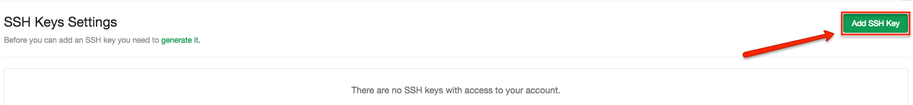
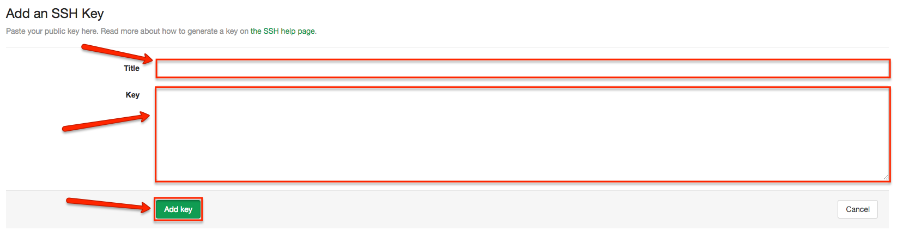

{{{
  "title": "Using Git with SSH",
  "date": "07-31-2015",
  "author": "Matt Wittmann, Greg McWilliams",
  "attachments": [],
  "contentIsHTML": false
}}}

IMPORTANT NOTE
--------------

CenturyLink WordPress hosting is currently in a Limited Beta program with specific customers by invitation only
and is not intended for production usage.

During the Limited Beta there is no production Service Level Agreement.

Prerequisites
-------------

1. You have [git](http://git-scm.com/) installed. To test this, type `git --version` at the command prompt.
2. You have [OpenSSH](http://www.openssh.com/) installed. To test this, type `ssh -v` at the command prompt.
3. You have successfully created a WordPress site with
   [CenturyLink's WordPress as a Service](https://wordpress.ctl.io/).
4. You have a basic comfort with a command prompt. All commands provided are meant to be entered into a Bash
   shell or similar.

Introduction
------------

SSH is a more secure way of making connections across the Internet. It relies on
[public-key cryptography](https://en.wikipedia.org/wiki/Public-key_cryptography) to secure its connections. SSH
users keep a private key secret and share a public key so that both ends of the connection can encrypt and decrypt
data as it is sent and received respectively. With tools like ssh-agent, keys can also be bound to the client
system's keychain or log-in so that key passphrases do not need to be typed with each use.

Overview
--------

1. First a public-private key pair must be generated.
2. The public key must be applied to your CenturyLink Git Hosting user account.
3. Git operations over SSH (clone, push, pull, fetch, etc.) can now be performed.

Generating a Public-Private Key Pair
------------------------------------

**Note:** Windows users will need to start the Git Bash prompt included with [Msysgit](https://msysgit.github.io/) to
follow these steps rather than using the standard Windows command prompt.

1. Check whether you already have an appropriate public-private key pair to use. Look for a pair of files in your
   ~/.ssh directory—one suffixed with `.pub` and the other without. If you have an appropriate set of keys already,
   you may use that if you wish. To view a listing of files in your ~/.ssh directory:

       ```
       ls ~/.ssh
       ```

2. If you need to generate a pair of SSH keys, run:

       ```
       ssh-keygen
       ```

   Follow the prompts. Provide a passphrase to strengthen security. You should remember or securely store
   (such as in a password keychain) the passphrase. Note the file name of the keys. The tool ssh-agent works
   with your system's log-in so that you won't have to type the passphrase every time.
3. Have the content of the public key ready (the public key ends in the `.pub` suffix).

       ```
       cat ~/.ssh/[your_key_file_name].pub
       ```

4. You may need to start the SSH Agent.

       ```
       eval "(ssh-agent -s)"
       ```

5. Add your new key to the SSH Agent.

       ```
       ssh-add ~/.ssh/[your_key_file_name]
       ```

Adding Your Public Key to Your Git Account
------------------------------------------

Now your public key needs to be associated with your CenturyLink Git Hosting account.

1. Log in to CenturyLink's Git Hosting and navigate to
   [the SSH keys on your account profile](https://git.wordpress.ctl.io/profile/keys).
2. Click "Add SSH Key".

   

3. Provide a title for your key. For example, you may choose to call it your Office Public Key or your Home Public Key.
4. Copy the content of your public key file and paste it into the key field.
5. Click "Add Key".

   

6. Test your set-up:

       ```
       ssh -T git@git.wordpress.ctl.io
       ```

   You should see a message welcoming you to git.

Using Git with SSH
------------------

Now you are ready to perform git operations over SSH!

1. Clone your git repository using the SSH clone URL.

       ```
       git clone git@git.wordpress.ctl.io:[siteName]/[siteName].git
       ```

Further git operations against the remote repository should now automatically use SSH if you have set everything
up correctly.
