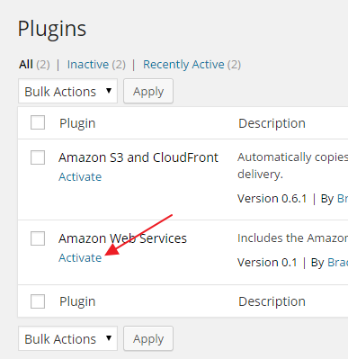

{{{
  "title": "WordPress Persistent Storage Configuration",
  "date": "07-17-2015",
  "author": "Bill Burge",
  "attachments": [],
  "contentIsHTML": false
}}}

### IMPORTANT NOTE

CenturyLink Cloud WordPress hosting is currently in a Limited Beta program with specific customers by invitation only and is not intended for production usage.

During the Limited Beta there is no production Service Level Agreement.

## Overview

CenturyLink Cloud WordPress sites utilize Object Storage for persistent WordPress content files such as images and file attachments.  In order to utilize persistent storage you must first have a CenturyLink Cloud manually configure Centurylink Cloud Object Storage using the following link:

[Using object storage from the control portal](../Object Storage/using-object-storage-from-the-control-portal.md)

Once object storage has been configured, you must edit your base WordPress *wp-config.php* file in your [CenturyLink Git Repository](https://git.wordpress.ctl.io) to integrate your Wordpress site with your object storage account.  

**Note: There are many methods to edit and commit this file. This knowledgebase covers editing the file in your localling cloned git repository.**

## Persistent Storage Configuration

1. Clone your WordPress Git Repo

2. Browse to the locally cloned git repository associated with the WordPress site to be updated and open wp-config.php in a text editor.

  

3. Find the section of the file labeled _CenturyLink Object Storage Customer Variables_

  In this section you will see three replaceable variables:

  * customer_access_key
  * customer_secret_access_key
  * customer_bucket

  **NOTE: These are variables you will have obtained when configuring your [CenturyLink Cloud Object Storage.](../Object Storage/using-object-storage-from-the-control-portal.md)**

  

4. Replace the variables and save the file.

  *The following example shows the variables replaced:*

  

5. Inside your repo, at the command line, running `git status` will now show you uncommited changes.

  

6. Commit your changes using the `git add` command.

  _In this example we will run git add * to add all files to the repo_

  

7. Running `git status` will show new files to commit.

  

8. Run `git commit` to commit files.

  

9. An editor will open. Insert a comment and save the file.

  

10. The CLI will then output file creation.

  

11. Run `git push` to push changes back to your Git Repository and force a restart of your WordPress site.

  

12. Login to your WordPress site and expand Plugins in the left column.

  

8. Click Activate next to the Amazon Web Services plugin.

  

9. Click Activate next to the Amazon S3 and CloudFront plugin.

  

10. Expand AWS in the left column.

  

11. Select S3 and Cloudfront

  

12. Ensure the following settings are configured and click Save Changes

  S3 Settings:

  * Ensure the bucket you created is selected in the drop down
  * Bucket is setup for virtual hosting - **UNCHECKED**
  * Set a far future HTTP expiration header for uploaded files - **UNCHECKED**
  * Object Path: wp-content/uploads/

  CloudFront Settings:

  * Domain Name - **ca.tier3.io/yourbucketname**
  * Implement object versioning by appending a timestamp to the S3 file path - **UNCHECKED**

  Plugin Settings:

  * Copy files to S3 as they are uploaded to the Media Library - **CHECKED**
  * Point file URLs to S3/CloudFront for files that have been copied to S3 - **CHECKED**
  * Remove uploaded file from local filesystem once it has been copied to S3 - **CHECKED**
  * Always serve files over https (SSL) - **UNCHECKED**
  * Copy any HiDPI (@2x) images to S3 (works with WP Retina 2x plugin) - **UNCHECKED**

  *The following example is correctly configured:*

  

13. Object storage is now configure.

  Any attachments uploaded to WordPress will now be stored in your CenturyLink Object Storage Bucket.
