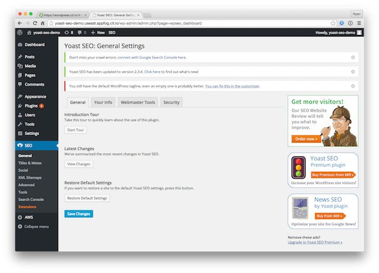
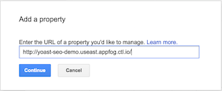
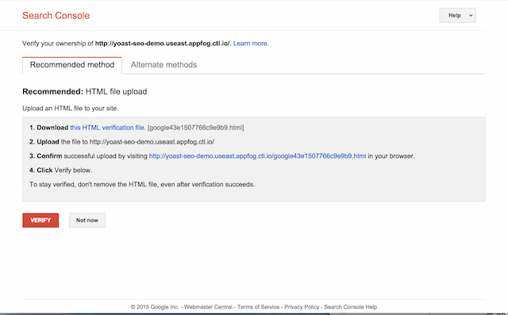
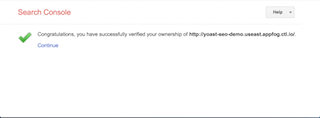

{{{
  "title": "How To Setup the Yoast SEO Plugin for WordPress",
  "date": "08-25-2015",
  "author": "Ryan Brockman",
  "attachments": [],
  "related-products" : [],
  "contentIsHTML": false,
  "sticky": false
}}}

### IMPORTANT NOTE

Lumen WordPress hosting is currently in a Limited Beta program with specific customers by invitation only and is not intended for production usage at this time.

During the Limited Beta there is no production Service Level Agreement.

### Overview
The [Yoast SEO Plugin for WordPress](https://yoast.com/wordpress/plugins/seo/) is a popular, full-featured plugin for [SEO](https://codex.wordpress.org/Search_Engine_Optimization_for_WordPress).  Most of what you need to know is already covered in the [excellent Yoast SEO Tutorial](https://yoast.com/articles/wordpress-seo/) that you can find on their website.  In this KB article, we will cover how to install and setup Yoast SEO on the [Lumen Cloud WordPress](https://www.ctl.io/wordpress) hosting platform so that you can take advantage of it.

### Installing the Yoast SEO Plugin

1. First you need to [download the plugin](https://yoast.com/wordpress/plugins/) from Yoast's website.  

2. Then follow the steps in our [KB article for WordPress Plugin Installation](../WordPress/wordpress-plugin-installation.md).  When you are done, you should have the plugin installed on your site, like this:

### Setting Up Your Site's URL(s) and Permalinks

Now that you have the plugin installed, go ahead and open the [Yoast SEO Tutorial](https://yoast.com/articles/wordpress-seo/).  In section 1, it makes several recommendations about setting up the URL and permalinks for your site.  For the most part, you can follow these recommendations as-is, but there are a couple of items to make note of:

1. In section 1.1.1 regarding Permalink Structure, Yoast refers to a separate article on [changing your permalink structure](https://yoast.com/change-wordpress-permalink-structure/) which includes instructions for adding "redirects" to your _.htaccess_ file.  Please note that this is not necessary on the Lumen WordPress hosting platform, and in fact will not work.  Instead, simply [modify your permalink structure](https://codex.wordpress.org/Using_Permalinks) using the WordPress admin console.

2. In section 1.1.2, Yoast discusses choosing between _WWW_ and _non-WWW_ domain names for your site.  The Lumen platform supports either one, but bear in mind that you must create a custom _vanity URL_.  See our [KB article](../WordPress/wordpress-custom-domain-configuration.md) for assistance with setting up a custom domain name for your WordPress site.

### Registering Your Domain with Google Webmaster Tools
After you have your site's URL's and Permalinks set up, the next thing Yoast recommends to do is register your site with [Google's Webmaster Tools](https://www.google.com/webmasters/tools/home?hl=en).  You'll need a Google account in order to complete this process.

1. Click the _Add A Property_ button, and enter the URL for your WordPress site:

  

2. Next, you will be asked to verify ownership of the site.  Choose the recommended method, which is HTML file upload.

  

3. Make sure you have cloned your site from Lumen's Git repository.  See our [KB article](../WordPress/wordPress-site-updates-with-git.md) for more information on how to do this.

4. Download the HTML verification file from Google into the root directory of your website.

5. Open up a Terminal, and add the file to Git to be tracked using the command:

  `git add $NAME_OF_HTML_VERIFICATION_FILE`

6. Commit the file in Git using the command:

  `git commit –m "Added Google HTML Verification file."`

7. Finally, push your changes back to Lumen's Git repo using the command:

  `git push origin master`

  This will deploy the new verification file to your Production site.

8. Now go back to Google Search Console, and click the Verify button.  Now your site is registered with Google.

  

For additional help with Google's Webmaster Tools, we recommend reviewing the [Google SEO Starter Guide](http://static.googleusercontent.com/media/www.google.com/en//webmasters/docs/search-engine-optimization-starter-guide.pdf) and [Google Webmaster Guidelines](https://support.google.com/webmasters/answer/35769?hl=en&ref_topic=6002025).

### Conversion Optimization and Comment Optimization

You should be able to work through Sections 2, 3, and 4 of the Yoast tutorial on your own.  However, when you get to sections 5-Conversion Optimization and 6-Comment Optimization, there is one important detail you will want to take care of.  

In both of these sections, Yoast refers to enabling functions like _Subscribe by Email_ that rely on an SMTP mail service like [Mail Chimp](http://mailchimp.com/).  If you choose to this, you'll need to install a SMTP mail plugin on your site.  

See our [KB article](../WordPress/wordpress-SMTP-Configuration.md) for help setting up SMTP mail for WordPress on Lumen Cloud.

### Conclusion
After completing the steps above, you should now be able to work thru the remaining sections of the Yoast SEO tutorial.
