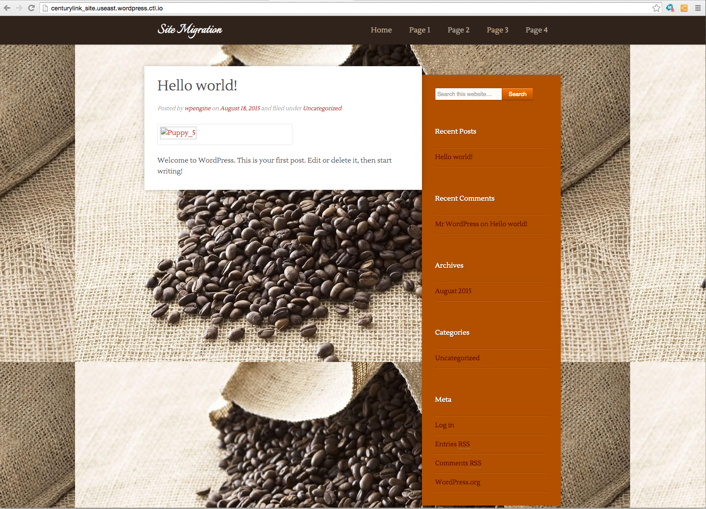

{{{
  "title": "WordPress Site Migration to CenturyLink Cloud",
  "date": "07-17-2015",
  "author": "Bill Burge",
  "attachments": [],
  "contentIsHTML": false
}}}
### IMPORTANT NOTE

CenturyLink Cloud WordPress hosting is currently in a Limited Beta program with specific customers by invitation only and is not intended for production usage.

During the Limited Beta there is no production Service Level Agreement.

## Overview:

There is currently no automated method for migrating an existing WordPress site to CenturyLink Cloud's WordPress. There are multiple methods that could be used to export and import an existing WordPress site into a CenturyLink Cloud WordPress site. This is one tested method. 

### This migration path assumes the following:

* Working knowledge of basic WordPress functionality
* Working knowledge of MySQL
* Working knowledge of PHPMyAdmin
* Working knowledge of Git.
* Working knowledge of how to [Install WordPress Plugins to CenturyLink Cloud WordPress](wordpress-plugin-installation.md)
* Working knowledge of how to [Create a CenturyLink Object Storage Bucket](../Object Storage/using-object-storage-from-the-control-portal.md)

### Prerequisites:

1.	An existing WordPress site
2.	The prefix of your WordPress database tables on your existing WordPress site. (you can get these via phpmyadmin if you do not know)
3.	A CenturyLink WordPress site
4.	The prefix of your CenturyLink WordPress database tables
5. A CenturyLink Object Storage bucket including the access key id and secret access key

## On the source WordPress site:

1. Install and activate [All-In-One WP Migration](https://wordpress.org/plugins/all-in-one-wp-migration/)

2. Open All-in-One WP Migration

  

3. Select Export

  
 
4. Replace the following

  * Find: source site database prefix
  * Replace: CenturyLink database prefix

  

  *In this example the originating site’s db prefix is wp1_ and the destination prefix is A67hf_*
	
5. Expand Advanced options, select the following options, and click EXPORT TO

  * Do not export media library (files)
  * Do not export themes (files)

  

6.	Select where you would like to save the file

  *In this example File is the selected option*
	
  

7.	Click DOWNLOAD LOCALHOST

  

## CenturyLink Git Changes:

1. Clone your CenturyLink Git repository to your desktop


2. Copy your wp-content/themes and wp-content/plugins into your CenturyLink Git repository (do not remove the Amazon plugins)


3. Sync your Git repository (this will force a restart of your CenturyLink WordPress Site)

## CenturyLink WordPress Site

1. Login to your WordPress site and activate All-in-One WP Migration

2. Open All-in-One WP Migration

3. Select Import

  

4. Drag your exported file into the Drag & Drop to upload area

  

5. Click Continue

  

6. This will begin the import of your database

  *sometimes this hangs and you will need to try your site in another browser tab*

  

7. Login to WordPress using your source blogs username/password.

8. In Media, all of your images will be broken.

  

## Fixing Media Content

  Media content is persistently stored in CenturyLink Object Storage

  Before continuing:

1. [Configure a CenturyLink Object Storage Bucket](../Object Storage/using-object-storage-from-the-control-portal.md)

2. Install an application for mounting Amazon Web Services (AWS) S3 Buckets

  _[CyberDuck for Mac](https://cyberduck.io) is used in this example._

3. Replace the following fields and click connect.

 
 * **Server:** ca.tier3.io
 * **Username:** CenturyLink Object Storage Access Key ID
 * **Password:** CenturyLink Object Storage Secret Access Key ID

   

4. Right Click your bucket and select New Folder and create a new folder named wp-content

   

5. Drag your WordPress Uploads folder into the wp-content folder in your Object Storage
 
   

6. Expand wp-content, right click uploads, and select Info

   

7. Expand the settings icon and select Everyone

   


8. In the permissions column select READ (permission changes will then propagate through the directory structure)

   

9. Login to phpMyAdmin


10. Select the postmeta table

   
	

11.	Select SQL

   

12. Edit the following SQL statement, paste it into SQL, and click Go

  Replace:

  * **ctl\_postmeta\_table_name1**: the postmeta table name in your db
  * **ctl\_bucket\_character\_length** the character count of your CenturyLink Object * Storage Bucket Name
  * **ctl\_bucket\_name**: your CenturyLink Object Storage Bucket Name
  * **ctl\_postmeta\_table\_name2**: the postmeta table name in your db

  Code to edit:

  `INSERT INTO ctl_postmeta_table_name1 (post_id, meta_key, meta_value)`
  `SELECT post_id, 'amazonS3_info' as meta_key, CONCAT('a:2:{s:6:"bucket";s:ctl_bucket_character_length:"ctl_bucket_name";s:3:"key";s:', CHAR_LENGTH(meta_value) + 19,':"wp-content/uploads/',meta_value,'";}') FROM ctl_postmeta_table_name2 WHERE meta_key = '_wp_attached_file'`

  In this example:

  * **ctl\_postmeta\_table_name1**: postmeta
  * **ctl\_bucket\_character\_length**: 14
  * **ctl\_bucket\_name**: wordpresstest1
  * **ctl\_postmeta\_table\_name2**: postmeta

  `INSERT INTO postmeta (post_id, meta_key, meta_value)`
  `SELECT post_id, 'amazonS3_info' as meta_key, CONCAT('a:2:{s:6:"bucket";s:14:"wordpresstest1";s:3:"key";s:', CHAR_LENGTH(meta_value) + 19,':"wp-content/uploads/',meta_value,'";}') FROM postmeta WHERE meta_key = '_wp_attached_file'`
	
   


12. If it is successful you will see that rows are inserted

  

13. In the postmeta table you will now see amazonS3_info rows

  

14. [Configure WordPress Persistent Storage](wordpress-persistent-storage-configuration.md)

15. Expand Media and you should now see your content:

  

