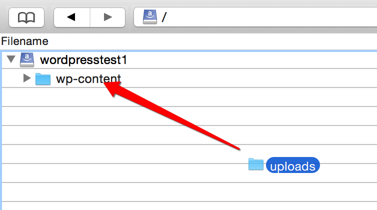

{{{
  "title": "WordPress Site Migration to CenturyLink WordPress Hosting",
  "date": "07-17-2015",
  "author": "Bill Burge",
  "attachments": [],
  "contentIsHTML": false
}}}
### IMPORTANT NOTE

CenturyLink WordPress hosting is currently in a Limited Beta program with specific customers by invitation only and is not intended for production usage.

During the Limited Beta there is no production Service Level Agreement.

## Overview:

There is currently no automated method for migrating an existing WordPress site to CenturyLink Cloud's WordPress. There are multiple methods that could be used to export and import an existing WordPress site into a CenturyLink Cloud WordPress site. This is one tested method that involves a paid plugin named WP Migrate Pro for it's ease of use.

### This migration path assumes the following:

* Working knowledge of basic WordPress functionality
* Working knowledge of Git.
* Working knowledge of how to [Install WordPress Plugins to CenturyLink Cloud WordPress](wordpress-plugin-installation.md)
* Working knowledge of how to [Create a CenturyLink Object Storage Bucket](../Storage/Object Storage/using-object-storage-from-the-control-portal.md)

### Prerequisites:

1.	An existing WordPress site
2.	A WordPress site on CenturyLink WordPress hosting platform
3. A CenturyLink Object Storage bucket including the access key id and secret access key

## On the source WordPress site:

1. Install and activate [WP Migrate DB Pro](https://deliciousbrains.com/wp-migrate-db-pro/) on your current site

2. Open WP Migrate Pro and select the settings to accept pull requests

  

## CenturyLink Git Changes:

1. Clone your CenturyLink Git repository to your desktop

2. Copy your wp-content/themes and wp-content/plugins from your old site into your CenturyLink Git repository (do not remove the Amazon plugins)

3. [Sync](https://www.ctl.io/knowledge-base/wordpress/wordpress-site-updates-with-git/) your Git repository (this will force a restart of your CenturyLink WordPress Site)

## CenturyLink WordPress Hosting

1. [Install](https://www.ctl.io/knowledge-base/wordpress/wordpress-plugin-installation/) and activate the [WP Migrate DB Pro Plugin](https://deliciousbrains.com/wp-migrate-db-pro/) on the CenturyLink hosted WordPress site.

2. Open WP Migrate Pro

3. Select Migrate and select Pull and insert the connection info from the current site and click the pull button

4. The migration of the database should be displayed as these images below

5. Login to WordPress admin, if you are having issues try using your old site blog username/password.
6. Now on your CenturyLink hosted site the media and your post images links will be broken.

  
  

## Fixing Images in Posts and Media

  Media content is persistently stored in CenturyLink Object Storage.

1. [Configure a CenturyLink Object Storage Bucket](../Storage/Object Storage/using-object-storage-from-the-control-portal.md)

2. Install an application for mounting Amazon Web Services (AWS) S3 Buckets

  _[CyberDuck for Mac](https://cyberduck.io) is used in this example._

3. Replace the following fields and click connect in Cyberduck, be sure to select S3.

 * **Server:** canada.os.ctl.io
 * Click Connect
 * **Access Key:** CenturyLink Object Storage Access Key ID
 * **Secret Key:** CenturyLink Object Storage Secret Access Key ID
 * Click Login

  
  

4. Right Click your bucket and select New Folder and create a new folder named wp-content

  

5. Drag your WordPress Uploads folder into the wp-content folder in your Object Storage

  

6. Expand wp-content, right click uploads, and select Info

  

7. Expand the settings icon and select Everyone

  

8. In the permissions column select READ (permission changes will then propagate through the directory structure)

  

9. Fix the URL's for the images by installing the [Velvet Blues Update URLs Plugin](https://wordpress.org/plugins/velvet-blues-update-urls/)

10. Select the URLs for attachments and replace the olr URL with the New URL and object storage bucketname

  

11.	After clicking Update URLs now, all of the images in the posts should be fixed

  

12. The final step is to delete all of the broken images in the media center and reupload the files that are now stored in the object storage bucket.
