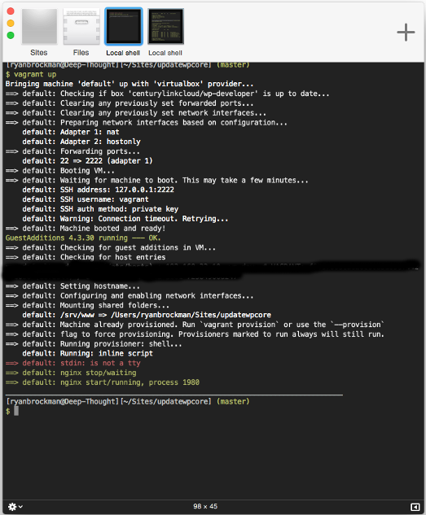
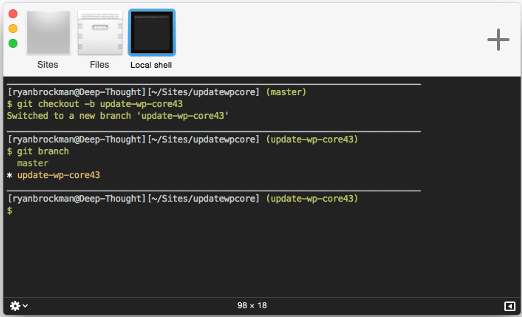
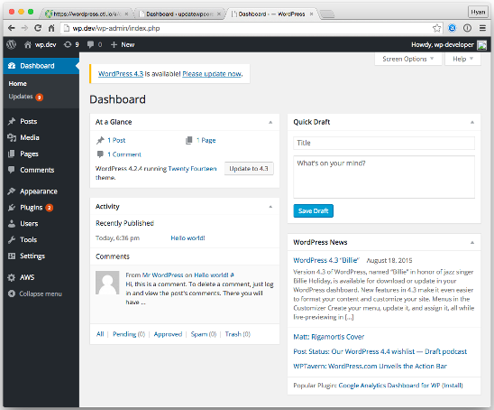
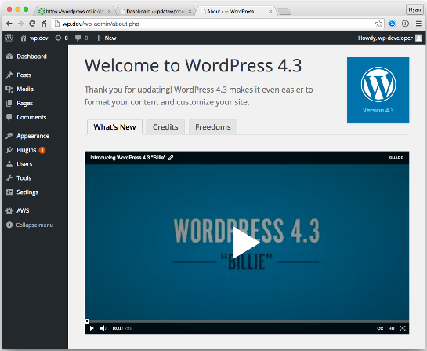
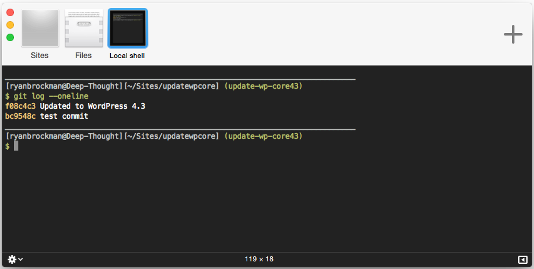

{{{
  "title": "How To Update WordPress Core",
  "date": "08-31-2015",
  "author": "Ryan Brockman",
  "attachments": [],
  "related-products" : [],
  "contentIsHTML": false,
  "sticky": true
}}}

### IMPORTANT NOTE

CenturyLink Cloud WordPress hosting is currently in a Limited Beta program with specific customers by invitation only and is not intended for production usage at this time.

During the Limited Beta there is no production Service Level Agreement.

### Overview

### Update process

1. Vagrant up

First, we are going to update WordPress core in a local development environment.  If you don't already have a local copy of WordPress running on your workstation, follow the steps in this [KB article](../WordPress/wordpress-local-development.md) to set one up before continuing.

To start up your local development environment, open up a Terminal and issue the following commands:

`cd /path/to/your/site`

`vagrant up`

Now, you can visit http://wp.dev to see the local copy of your WordPress site.

2. Create branch

Next, you need to create a branch in Git for the changes we are about to make to WordPress.

`git checkout -b update-wp-core43`

3. Running the WordPress updater

Click the _Please update now_ link in the Dashboard home page.

In the WordPress Updates screen, click on the Update Now button.

The update process will take a minute or two to complete.  When it is finished, you should see a screen like this:

6. Regression test your site

Now, you are going to want to regression test your site against the new core updates.  Take your time with this, and thoroughly test all themes and plugins that you have added to your site to ensure nothing has broken.  You may have to upgrade these to make them work with the new version of WordPress core if the author has released a new version.

Don't continue to the next step until you are absolutely sure that everything is working correctly.

7. Stage and commit changes in Git

Now its time to stage the core updates in Git:

  `git add .`

And then, commit the changes:

  `git commit -m "Updated to WordPress 4.3"`

Now, you should see the new commit in Git's log:

8. Merge changes into master

9. Push changes to origin/master to update site in production

10. Test and verify in PROD
