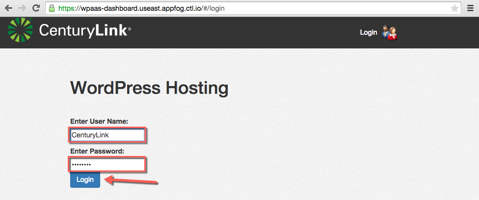
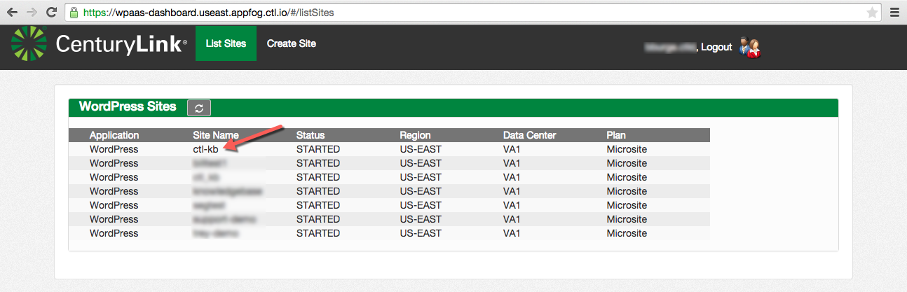
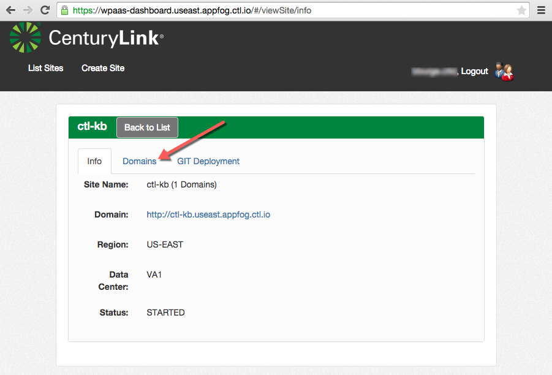
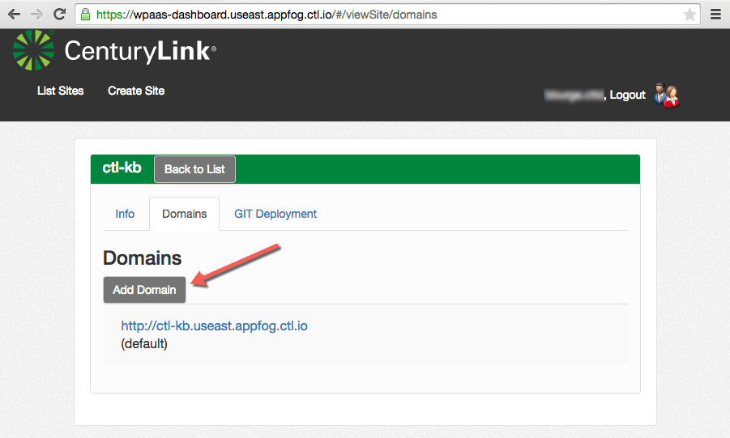
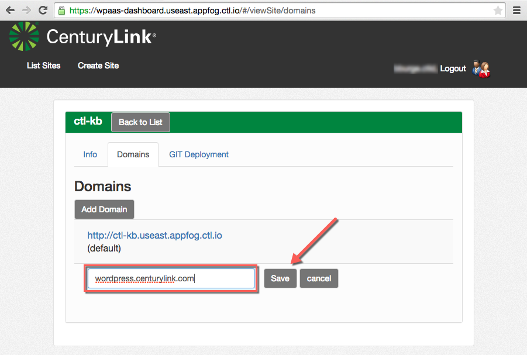
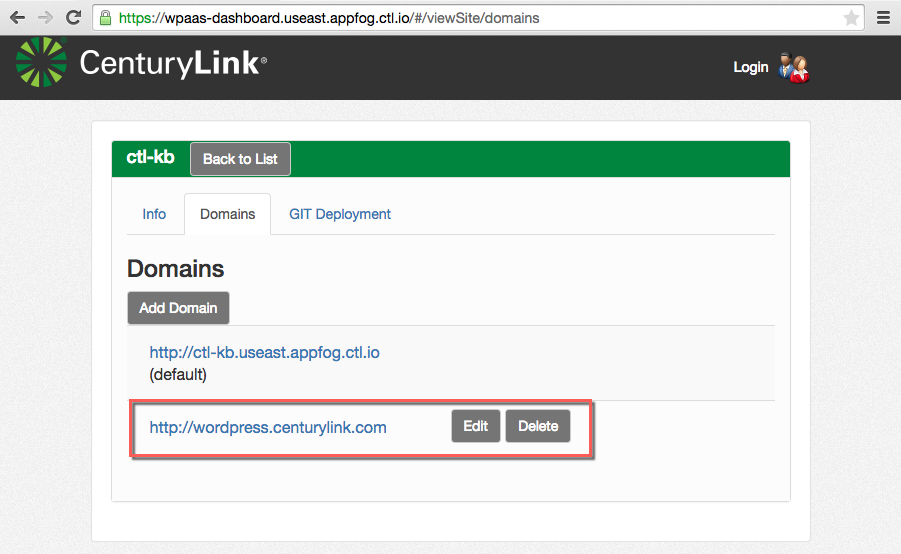

{{{
  "title": "WordPress Custom Domain Configuration",
  "date": "05-15-2015",
  "author": "Bill Burge",
  "attachments": [],
  "contentIsHTML": false
}}}

CenturyLink Cloud WordPress supports custom domain name configuration after [setting up a new site](getting-started-with-managed-wordpress.md "Getting Started with Managed WordPress").

1. Browse to https://wpaas-dashboard.useast.appfog.ctl.io, login with your CenturyLink Cloud User Name and Password and click Login

  

2. From the list of WordPress Sites, select the site you would like to configure a custom domain for.

  _In this example ctl-kb_

  

3. Select the Domains tab.

  

4. Click Add Domain

  

5. Input your domain name and click Save

  _in this example wordpress.centurylink.com_
  
  

6. You will then see your saved domain name as an additional domain that can be edited or deleted.

  

7. Login to your WordPress site using the CenturyLink Cloud provided URL and browse to Settings > General

  

8. Find the section with the following variables
  * WordPress Address (URL)
  * Site ADdress (URL)

  

9. Input your domain name 

  _in this example wordpress.centurylink.com_
  
  

10. Scroll to the bottom and click Save Changes

  
  
11. Your site is now using your custom domain name.